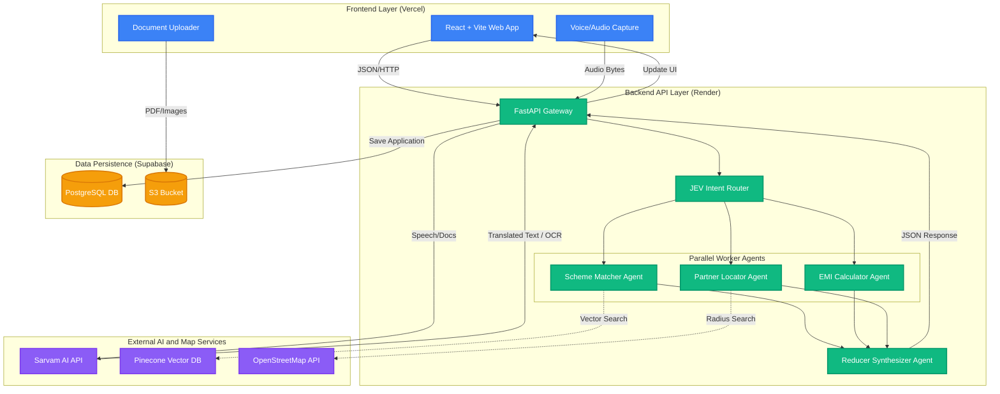

# Sahay AI 🇮🇳
**Smart India Hackathon (SIH 2026) Project**  
**Problem Statement ID:** SIH26092 - AI-Driven Scheme Matching for Marginalized Entrepreneurs  
**Team Name:** Skyline Stars  
**Theme:** Smart Automation  
**Category:** Software

---

## 📖 Executive Summary
Sahay AI is a highly resilient, multi-modal, agentic AI platform designed specifically to bridge the financial literacy gap for marginalized entrepreneurs in India. It empowers rural citizens, micro-entrepreneurs, and low-literacy users to access government credit schemes (like NBCFDC and NSFDC) via an intuitive, voice-first interface. 

The platform utilizes an advanced **Job Execution Vehicle (JEV)** to route complex intents to a suite of parallel AI Agents that handle Scheme Matching, EMI Calculation, and Geospatial Partner Routing.

### Key Links
- **Live Platform:** [https://sahayai-five.vercel.app](https://sahayai-five.vercel.app)
- **Backend API Health:** [https://sahayai-4dzp.onrender.com/api/health](https://sahayai-4dzp.onrender.com/api/health)

---

## 🏗️ Technical Architecture & Stack

### Frontend (User & Perception Layer)
- **Framework:** React.js + TypeScript + Vite (Deployed on Vercel)
- **Styling:** Tailwind CSS + Framer Motion (Accessible, mobile-first design)
- **State Management:** React Context API + LocalStorage caching (for offline resilience and session recovery)
- **Voice-First UX:** Custom audio streaming integrations to handle low-bandwidth environments.

### Backend (Cognitive & Routing Layer)
- **Framework:** Python 3.10+ with FastAPI (Deployed on Render)
- **Concurrency:** Fully asynchronous (`async/await`) leveraging `uvicorn` and `httpx` for high-throughput I/O.
- **Routing:** Custom JEV (Job Execution Vehicle) that classifies intents and orchestrates worker agents.

### Database & Security Layer (Supabase)
- **PostgreSQL:**
  - `user_profiles`: Demographics, loan requirements, income data.
  - `user_sensitive_attributes`: Caste, disability flags, and ID proof linkages.
  - `applications`: End-to-end tracking of submitted loans, assigned schemes, and partner banks.
- **Supabase S3 Storage:** Secure document bucket (`Documents`) segmented by `Caste Certificate`, `Income Certificate`, and `ID Proof`.
- **Security:** Strict Row Level Security (RLS) policies implemented to guarantee absolute data privacy. PII is strictly decoupled from LLM inference.

---

## 🧠 AI Integrations & The Multi-Agent Pipeline

Our backend is not a simple monolithic API. It is an orchestration of specialized, parallel AI Agents.

### 1. Sarvam AI Integration (Perception Layer)
To cater to India's linguistic diversity, we deeply integrated the Sarvam AI API:
- **Speech-to-Text (STT):** Converts regional spoken language directly into actionable English transcripts.
- **Translation (Mayura):** Context-aware translation of complex government financial terminology.
- **Text-to-Speech (Bulbul):** Reads out complex scheme requirements and EMI plans to low-literacy users in natural voices.
- **Document Digitisation (OCR):** Extracts fields directly from uploaded PDFs and images.

### 2. Multi-Agent Pipeline (JEV Orchestrator)
When a user submits a voice or text query, the JEV Stub Router dynamically fans-out the request to:
- **Agent 1 - Scheme Matcher (RAG + Rules):** Uses **Pinecone Vector Database** to perform semantic similarity searches against government scheme documents. It filters results through strict demographic rules (e.g., Mahila Samriddhi Yojana strictly prioritizing women).
- **Agent 2 - EMI Calculator (Deterministic Engine):** A zero-hallucination agent. Instead of relying on LLMs for math (which can hallucinate), this agent uses strict reducing-balance algorithms to generate precise amortization schedules, total interest, and moratorium period logic.
- **Agent 3 - Partner Locator (Geospatial):** Connects to the **OpenStreetMap (OSM) Overpass API** to dynamically route the citizen to the nearest actively-processing State Channelizing Agency (SCA) or Nodal Bank, ranked by `distanceKm`.
- **Reducer Agent (Fan-In Synthesizer):** A final consensus agent that merges the parallel JSON outputs, removes duplicates, and applies safety guardrail checks to ensure output compliance.

---

## 🛡️ "Ultra-Safe" Fallback Architecture (Our USP)

Designing for rural India means designing for unreliable internet and failing third-party APIs. We built **Graceful Degradation** into the core of the backend:

1. **RAG Fallback:** If the Pinecone API times out or rate limits, the Scheme Matcher instantly degrades to a deterministic keyword/regex rule engine. The citizen *always* gets a scheme match.
2. **Geospatial Fallback:** If the live OpenStreetMap Overpass API fails, the Partner Locator instantly falls back to an in-memory cached seed of verified state channel partners. The map UI *never* breaks.
3. **Sarvam AI Fallback:** All Sarvam API calls are wrapped in strict `try/except` safety blocks. If credits run out, the app gracefully degrades to standard text processing without throwing 500 server errors.

---

## 🚀 Local Setup & Installation

### Prerequisites
- Node.js (v18+)
- Python (3.10+)
- Supabase CLI (Optional)

### 1. Frontend Setup
```bash
# Navigate to the project root
npm install

# Create a .env file and add your Vite variables
# VITE_SUPABASE_URL, VITE_SUPABASE_ANON_KEY

npm run dev
```
The frontend will start at `http://localhost:5173`.

### 2. Backend Setup
```bash
cd backend

# Create and activate virtual environment
python -m venv venv
# On Windows:
venv\Scripts\activate
# On Mac/Linux:
source venv/bin/activate

# Install requirements
pip install -r requirements.txt

# Create a .env file based on .env.example
# Add SUPABASE, SARVAM, and PINECONE keys

# Run the FastAPI server
uvicorn main:app --reload
```
The backend will start at `http://localhost:8000`. API docs available at `http://localhost:8000/docs`.

---

## 📂 Project Structure
```text
Sahay AI/
├── src/                      # React Frontend Source
│   ├── components/           # Reusable UI (Forms, Charts, Maps)
│   ├── screens/              # Core Application Views
│   ├── services/             # API Clients (Supabase, AgentAPI)
│   ├── i18n/                 # Localization & Translation strings
│   └── context/              # Global State Management
├── backend/                  # FastAPI Backend Source
│   ├── main.py               # API Routing & Orchestration
│   ├── agents/               # Scheme, EMI, Partner, and Reducer Agents
│   ├── adapters/             # Sarvam AI, OSM Geo, and JEV Router Adapters
│   └── config.py             # Environment configuration
├── package.json              # Frontend dependencies
└── README.md                 # Project Documentation
```

---
**Built with ❤️ by Skyline Stars for a stronger, more inclusive India.**


## 📊 System Architecture Diagram


